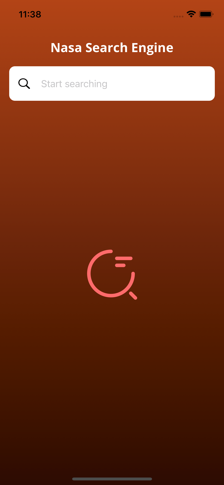
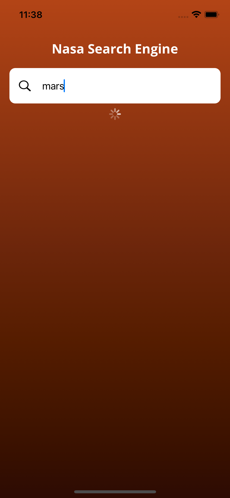
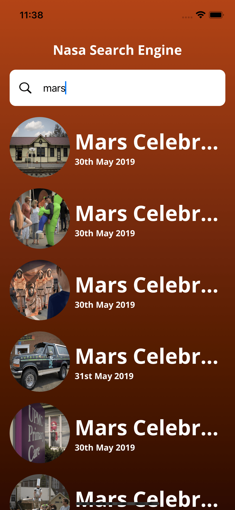

## Overview

Application to search for images from NASA API with the following features:

- MVVM
- Abstract Network Layer
- SwiftUI
- Async/Await
- Combine
- Dependency Injection Design Pattern
- Unit Testing: Network Layer
- Network Stubs for Testing

## Dependencies installed via SwiftPM:

- [OHTTPS:](https://github.com/AliSoftware/OHHTTPStubs) framework for stubbing network requests
- [Kingfisher:](https://github.com/onevcat/Kingfisher)  for downloading and caching images from the web
- [R.swift:](https://github.com/mac-cain13/R.swift/tree/main) for strong typed, autocompleted resources like images, fonts 

## Installation

1.  Clone the repository.
2.  Open the project in Xcode.
3.  Build and run the app on a simulator or physical device.

## Requirements
-   iOS 15.0 or higher
-   Xcode 13 or higher
-   Swift 5.3 or higher

## Screenshots

